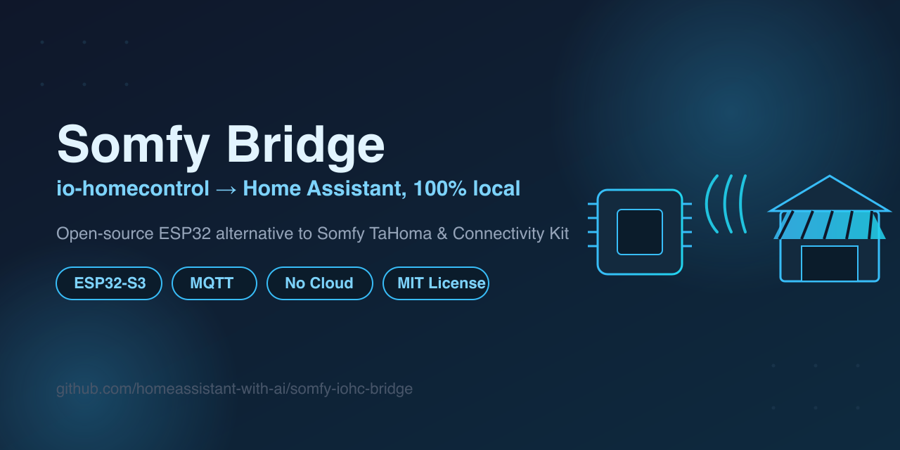

# Somfy Bridge — Control Somfy io-homecontrol from Home Assistant (ESP32, local, no cloud)



*Also available in [Dutch / Nederlands](README.md).*

[](https://github.com/homeassistant-with-ai/somfy-iohc-bridge/actions/workflows/tests.yml)
[](LICENSE)
[](platformio.ini)
[](#home-assistant-configuration)
[](#credits)

By [homeassistant-with-ai](https://github.com/homeassistant-with-ai) — free to use, modify, and fork for **non-commercial** purposes, with mandatory attribution/link back to the source. Not permitted: reselling (including modified versions, or as pre-flashed hardware). See [LICENSE](LICENSE) (CC BY-NC 4.0).

**A cheap, open-source alternative to the Somfy TaHoma Switch and the
Somfy Connectivity Kit.** This DIY Somfy bridge makes a Somfy
io-homecontrol awning, roller shutter, or curtain motor (tested with a
**Situo 1 io Pure II** remote) controllable from **Home Assistant** via
**MQTT** — 100% local, without Somfy TaHoma, the Connexoon app, a Somfy
cloud account, or any other internet service. Runs on an inexpensive
**ESP32-S3 + SX1262** radio (Heltec WiFi LoRa32 V3), built with
**RadioLib** and **PlatformIO**.

### Why this Somfy bridge instead of a TaHoma Switch or Connectivity Kit?

| | Somfy TaHoma Switch | Somfy Connectivity Kit | **This Somfy Bridge (DIY)** |
|---|---|---|---|
| Approx. price\* | ~€130–150 | ~€100–130 | **~€20–25** (Heltec WiFi LoRa32 V3) |
| Cloud/account required | Yes (Somfy cloud) | Yes (Somfy cloud) | **No — fully local** |
| Open source | No | No | **Yes (CC BY-NC 4.0 — non-commercial, attribution required)** |
| Customizable/extensible | No | No | **Yes — full source code** |
| Works during an internet outage | No (cloud-dependent) | No (cloud-dependent) | **Yes** |

\* Approximate prices, they vary by region and over time — check current
prices yourself. Listed to indicate the cost savings, not as a firm claim.

**Keywords:** Somfy io-homecontrol Home Assistant, Somfy without TaHoma,
Somfy without Connexoon, Somfy without cloud, ESP32 Somfy bridge, Somfy
MQTT, Heltec WiFi LoRa32 V3 Somfy, Somfy awning home automation, Somfy
Connectivity Kit alternative, Somfy TaHoma Switch alternative, DIY smart
home Somfy, RadioLib SX1262 Somfy.

The bridge:
- pairs as a **new, authorized remote** with your motor via the normal PROG procedure (no security bypassed, no replay attack)
- sends Open/Close/Stop over 868.95 MHz FSK, protocol-compatible with io-homecontrol 1W
- **also listens in** on your original Situo, so the displayed position stays in sync when you use that remote (experimental feature, see below)
- registers itself in Home Assistant via MQTT Discovery as a normal `cover` entity
- stores the pairing (address, key, counter) in ESP32 NVS flash, so a reboot doesn't require re-pairing

## Supported hardware

**Built and tested on:** Heltec WiFi LoRa32 **V3** (ESP32-S3 + SX1262).

The protocol layer (`lib/iohc/`) is hardware-independent and testable on
the host; the radio-specific code (`src/tx_control.cpp`, `src/rx_control.cpp`,
`platformio.ini`) is written and verified specifically for the SX1262 on
this board.

## Required libraries (PlatformIO handles this automatically)

See `platformio.ini` — PlatformIO downloads these itself on the first build:

| Library | Purpose |
|---|---|
| `jgromes/RadioLib` | SX1262 radio control (FSK TX/RX) |
| `thingpulse/ESP8266 and ESP32 OLED driver for SSD1306 displays` | OLED status screen |
| `knolleary/PubSubClient` | MQTT client |
| `bblanchon/ArduinoJson` | Building the Home Assistant discovery JSON |

## Build

```bash
pio run
```

Run from the project directory (`somfy-iohc-bridge/`). The first build
takes longer (toolchain download); subsequent builds are fast.

## Flash

Connect the board via USB-C and find the port name:

```bash
ls /dev/cu.usbserial-*      # macOS, usually something like /dev/cu.usbserial-0001
```

```bash
pio run -t upload --upload-port /dev/cu.usbserial-0001
```

## Serial monitor

```bash
pio device monitor -p /dev/cu.usbserial-0001 -b 115200
```

On startup, the firmware first runs a series of **self-tests**
(crypto, frame construction) against known, verified test vectors from
the protocol documentation. If those fail, the firmware stops with a
clear error message — it never attempts to transmit with potentially
broken logic.

## Configuration: WiFi and MQTT (secrets.h)

WiFi and MQTT credentials are **not** in Git. Copy the example and fill it in:

```bash
cp include/secrets.h.example include/secrets.h
```

```cpp
#define WIFI_SSID     "your-wifi-name"
#define WIFI_PASSWORD "your-wifi-password"

#define MQTT_HOST     "homeassistant.local"   // or your HA instance's IP
#define MQTT_PORT     1883
#define MQTT_USER     "mqtt-username"         // a separate, non-admin HA user account is recommended
#define MQTT_PASSWORD "mqtt-password"
```

`include/secrets.h` is in `.gitignore`. Without this file the project
won't compile (on purpose — so you can never accidentally flash without
configuration).

**Creating an MQTT user in Home Assistant:** Settings → People →
Users → Add user. No Administrator rights needed.

## Somfy pairing

The bridge pairs itself as a **new remote** via your motor's normal PROG
procedure — nothing is bypassed.

1. Flash the firmware and open the serial monitor.
2. Put your Somfy motor into **PROG/learning mode** (via the PROG button on
   your existing Situo, or on the motor/wall switch itself — depending on
   your installation).
3. Within that time window, hold the **BOOT button** on the board for
   **>1.5 seconds**.
4. The firmware generates a new random address + 128-bit key, and sends
   the pairing command (0x39 + 0x30) to the broadcast address.
5. The OLED screen shows "Connected" once the transmission is complete.

> **Important:** io-homecontrol 1W gives **no confirmation** back. "Connected"
> means the bridge successfully **transmitted**, not that the motor definitely
> accepted it. Test one command afterward (step below) and check whether the
> screen really moves.

**Testing:** a short press of the BOOT button cycles through CLOSE → STOP → OPEN.
From Home Assistant, the `cover.zonnescherm` entity (or whatever you renamed
it to) works directly with the standard Open/Stop/Close controls.

After a successful pairing, the identity (address, key, sequence counter)
is **automatically saved to NVS flash** — so a reboot, power loss, or
re-flash with the same firmware does **not** require re-pairing.

**Your original Situo keeps working as normal** — pairing adds the bridge
as an additional remote; nothing from the existing pairing is erased or
overwritten.

## Home Assistant configuration

Mostly automatic via **MQTT Discovery**:

1. Make sure Home Assistant's built-in **MQTT integration** is active and
   connected to the same broker as in `secrets.h`
   (Settings → Devices & Services → Add integration → MQTT,
   if it doesn't already exist).
2. As soon as the bridge connects, a device called **"Somfy Bridge"**
   with a `cover` entity automatically appears under Settings → Devices & Services → MQTT.
3. Optionally rename the entity to your liking (Settings → Entities →
   search "Zonnescherm" → pencil icon).

**MQTT topics** (for anyone who wants to use it standalone, without Home Assistant):

| Topic | Direction | Content |
|---|---|---|
| `somfy/awning/set` | to bridge | `OPEN` / `CLOSE` / `STOP` |
| `somfy/awning/state` | from bridge | `open` / `closed` (retained) |
| `somfy/awning/availability` | from bridge | `online` / `offline` (Last Will) |

The published state is always an **assumption** based on the last command
given (via Home Assistant, the BOOT button, or — experimentally —
detected signals from your original Situo). io-homecontrol 1W provides no
real position feedback from the motor; an absolute percentage position is
therefore not available.

## RX-sniffing: listening in on the original Situo (experimental)

The bridge also passively listens on 868.95 MHz to detect when you use the
**original Situo**, and then updates the displayed position itself (both
OLED and Home Assistant) — without the bridge transmitting anything itself.

**How it works:** the SX1262 doesn't support a raw receive mode, so the
radio's hardware sync word is set to part of our own UART-wrapped bit
pattern (`0x7F 0xD9`) to trigger reception; the rest is decoded in software
and validated against the CRC.

- Only frames from the **specific address of your own remote** are acted
  on, set via `SOMFY_REMOTE_SRC` in `include/secrets.h` (not in Git, so
  every fork/user fills in their own address) — a neighboring Somfy remote
  therefore doesn't affect the status.
- Misidentified noise is discarded thanks to the CRC check; at worst the
  screen shows the wrong position once, but a command is never sent to the
  motor based on what was received.
- **How to find your own address:** flash the firmware with the placeholder
  value from `secrets.h.example`, open the serial monitor, press your own
  remote, and read the `src` field from the `[RX]` log lines. Fill that in
  under `SOMFY_REMOTE_SRC` in your own `secrets.h` and flash again.

## Project structure

```
somfy-iohc-bridge/
├── platformio.ini          Board/library configuration
├── include/
│   ├── secrets.h.example   Template for WiFi/MQTT config
│   └── secrets.h           Your own config (not in Git)
├── lib/
│   ├── iohc/                io-homecontrol protocol layer (hardware-independent, host-testable)
│   │   ├── iohc_crc.h        CRC-16 (verified against a real capture)
│   │   ├── iohc_crypto.*     AES key transfer, 1W authentication IV
│   │   ├── iohc_frame.*      Generic frame header construction/CRC
│   │   ├── iohc_commands.*   Somfy-specific pairing/button frames
│   │   ├── iohc_phy.*        UART bit framing (encode + decode)
│   │   └── iohc_constants.h  Verified protocol constants (with source references)
│   ├── storage/nvs_store.*  Persistent storage of pairing identity (ESP32 NVS)
│   └── ui/display.*         OLED status screen
├── src/
│   ├── main.cpp             Startup sequence, self-tests, BOOT button
│   ├── tx_control.*         Pairing and button transmission (radio TX)
│   ├── rx_control.*         Passive reception/sniffing (radio RX)
│   └── net_control.*        WiFi, MQTT, Home Assistant discovery
└── test/                    Host-native tests (g++, no hardware needed)
```

**Running the host tests** (validates protocol logic without an ESP32):

```bash
cd test
g++ -std=c++17 -I ../lib/iohc -o /tmp/t test_crc.cpp && /tmp/t
g++ -std=c++17 -I ../lib/iohc -o /tmp/t test_crypto.cpp ../lib/iohc/iohc_crypto.cpp -lcrypto && /tmp/t
g++ -std=c++17 -I ../lib/iohc -o /tmp/t test_frame.cpp ../lib/iohc/iohc_frame.cpp && /tmp/t
g++ -std=c++17 -I ../lib/iohc -o /tmp/t test_commands.cpp ../lib/iohc/iohc_commands.cpp ../lib/iohc/iohc_frame.cpp ../lib/iohc/iohc_crypto.cpp -lcrypto && /tmp/t
g++ -std=c++17 -I ../lib/iohc -o /tmp/t test_phy.cpp ../lib/iohc/iohc_phy.cpp && /tmp/t
g++ -std=c++17 -I ../lib/iohc -o /tmp/t test_phy_decode.cpp ../lib/iohc/iohc_phy.cpp ../lib/iohc/iohc_commands.cpp ../lib/iohc/iohc_frame.cpp ../lib/iohc/iohc_crypto.cpp -lcrypto && /tmp/t
```

## Troubleshooting

**Build fails with "secrets.h not found"**
→ `cp include/secrets.h.example include/secrets.h` and fill in your details.

**Board not found at `/dev/cu.usbserial-*`**
→ Check the USB cable (some are charge-only). On macOS a CH9102/CP210x
driver may be needed — usually installed automatically.

**Radio init fails (`[RADIO] beginFSK(...) FAILED`)**
→ Check the pin `build_flags` in `platformio.ini` against your exact
board revision. A loose connection between the ESP32 and SX1262 (rare, but
possible with a defective board) produces the same error.

**Crypto or frame self-test fails on startup**
→ This should never happen on unmodified code; it indicates corrupted
flash or an incorrectly compiled library version. Fully erase the flash
(`pio run -t erase`) and re-flash.

**Pairing appears to succeed, but the motor doesn't move on a test command**
→ Often: the PROG time window had already expired when the bridge
transmitted, or the motor wasn't actually in learning mode. Repeat the
pairing procedure. There's no risk in trying again.

**Home Assistant doesn't show a "Somfy Bridge" device**
→ Check that HA's **MQTT integration** (not just the Mosquitto broker
itself) has been added and is connected. Check the serial log for
`[MQTT] Connected` and `[MQTT] Discovery config published`. If the
publish fails: likely an MQTT buffer issue — see `MQTT_MAX_PACKET_SIZE`
in `platformio.ini`.

**Home Assistant and the actual position drift apart**
→ Expected behavior if you use the original Situo outside the range of
the RX-sniffing feature (e.g. if it just misses a packet), or if the
awning was ever moved manually. Send the correct command once (Open/Close)
via Home Assistant or the BOOT button to correct it.

## Recovery: lost pairing/counter

If the stored identity ever becomes corrupted, or you just want to start over:

1. Erase the NVS namespace: the easiest way is to fully erase the flash
   (`pio run -t erase`, followed by re-flashing), or temporarily add a call
   to `store::clear()` in `setup()`, flash, then remove that line again.
2. Repeat the normal pairing procedure (see above) — your motor remembers
   its own key slots just fine across multiple pairings from the same
   bridge in a row; no duplicate/orphaned pairing arises as long as you
   don't keep picking a new random NodeID without removing the old one
   (in practice this just fills one slot on your motor, usually not an
   issue for a single device).

The **sequence counter** is written directly to NVS on every transmission,
so a crash or power loss mid-transmission doesn't cause desynchronization
with the motor — at worst a sequence number gets skipped, which
io-homecontrol allows just fine (numbers don't need to be strictly
sequential, just never reused).

## Credits

This is **not a fork** — this project shares no Git history and no copied
source code with any other project, and was written from scratch. The
protocol values in `lib/iohc/` were, however, verified against public
sources, with thanks to:

- **[iown-home](https://github.com/rspaargaren/iown-home)** (rspaargaren) —
  protocol documentation (`docs/radio.md`, `docs/linklayer.md`, `docs/commands.md`)
  with real sniffed example frames, used as the primary reference. Note:
  their own `iohome_constants.h` source contains at least two errors
  relative to their own documentation (see the source citation in
  `lib/iohc/iohc_constants.h`) — which is why it was deliberately NOT
  copied blindly, only their documentation/example frames were used.
- **[samr037/iohc-flipper](https://github.com/samr037/iohc-flipper)**
  (Apache-2.0) — a hardware-validated Flipper Zero implementation, used to
  independently confirm the button/pairing frame construction and the
  vendor/manufacturer IDs. One constant (`IOHC_VENDOR_SOMFY`) traces back
  through it to `rspaargaren/iown-homecontrol-esp32sx1276` (also
  Apache-2.0) — see the source citation in `lib/iohc/iohc_constants.h` for
  the exact provenance.

Both sources are cited per constant/function in the code comments of
`lib/iohc/`, so every value is traceable.

## Key limitations (stated explicitly, not hidden)

- **No real position feedback.** io-homecontrol 1W is one-way traffic; all position display is an assumption.
- **RX-sniffing is experimental** and tied specifically to this one Situo address — if you replace the remote, `KNOWN_REMOTE_SRC` needs to be updated.
- **One device per bridge at this time.** The code always transmits to the broadcast address; multiple independently controllable motors would require an extension (device registry + per-device MQTT topics).
